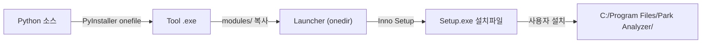
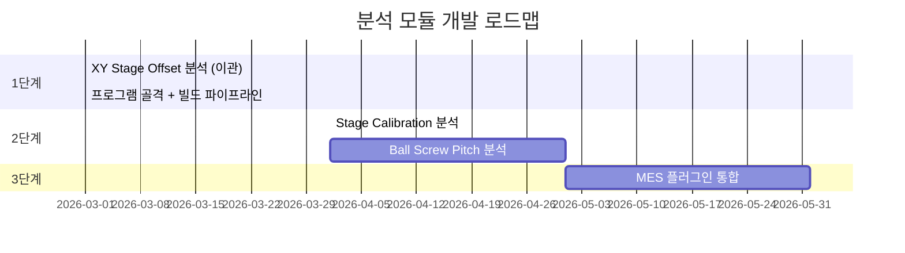

# 독립 설치형 분석 프로그램 — 기술 스택 가이드

## 1. 배경 및 목적

QC Check MES는 장비 구성(Config Wizard), 체크리스트 관리, 규칙 엔진 등 구현할 기능이 많아 완성까지 시간이 걸립니다. 반면, 분석 플러그인(XY Stage Offset 등)은 이미 독립 실행 가능한 수준으로 개발되어 있으므로, **MES 완성 전에 분석 툴을 먼저 독립 프로그램으로 배포**하고, 향후 MES 플러그인으로 통합하는 전략입니다.

> [!IMPORTANT]
> **핵심 원칙**: 분석 로직(`analyzer.py`, `models.py` 등)은 **MES 플러그인과 100% 동일한 코드**를 사용하고, UI/빌드 설정만 독립 프로그램용으로 구성합니다. 코드 fork가 아닌 **공유 모듈** 방식을 권장합니다.

---

## 2. 프로그램 이름

### ✅ **Park Analyzer** — 장비 분석 올인원 도구

- 간결하고 직관적, Park Systems 브랜드와 자연스럽게 연결
- 확장성 우수 — `Ball Screw`, `Stage Calibration` 등 모듈을 추가해도 이름이 자연스러움
- MES와 독립적으로 운영 가능한 브랜딩

---

## 3. 기술 스택 상세

### 3.1 언어 & 런타임

| 항목 | 선택 | 버전 | 이유 |
|------|------|------|------|
| **Python** | ✅ | 3.11+ | MES와 동일, 분석 모듈 코드 공유 필수 |

### 3.2 GUI 프레임워크

| 항목 | 선택 | 버전 | 이유 |
|------|------|------|------|
| **PySide6** | ✅ | ≥ 6.6 | MES와 동일, 다크 테마 QSS 공유, matplotlib 통합 |

### 3.3 데이터 분석

| 라이브러리 | 버전 | 용도 |
|-----------|------|------|
| **numpy** | ≥ 1.26 | 수치 연산, 행렬 계산 |
| **scipy** | ≥ 1.12 | Affine Transform 최소자승법 (`scipy.linalg.lstsq`) |
| **pandas** | ≥ 2.1 | CSV 파싱, DataFrame 기반 통계 |
| **matplotlib** | ≥ 3.8 | 차트 시각화 (Contour Map, Vector Map, Trend 등) |

### 3.4 파일 포맷

| 라이브러리 | 용도 |
|-----------|------|
| **openpyxl** ≥ 3.1 | Excel 리포트 내보내기 |
| **tifffile** ≥ 2024.1 | TIFF Raw Data 로드 (2D Image) |
| **Pillow** ≥ 10.0 | 이미지 처리 보조 |

### 3.5 인프라

| 라이브러리 | 용도 |
|-----------|------|
| **loguru** ≥ 0.7 | 로깅 (파일 + 콘솔) |

> [!NOTE]
> 독립 프로그램에서는 **DB(SQLAlchemy/PostgreSQL)**, **pydantic**, **Alembic** 등은 **불필요**합니다. 분석 결과는 파일(CSV/Excel/PDF)로 저장하므로 DB 없이 운영됩니다.

### 3.6 빌드 & 패키징

| 도구 | 버전 | 용도 |
|------|------|------|
| **PyInstaller** | ≥ 6.0 | Python → standalone exe 패키징 |
| **Inno Setup 6** | 6.x | Windows 설치 프로그램 생성 (.exe Installer) |

> Note: Tool 모듈은 `--onefile` (단일 exe), 런처는 `--onedir` (폴더 + exe) 모드로 빌드한다.

### 3.7 배포 체인 요약



---

## 4. 프로젝트 구조 (권장)

```
park_analyzer/                      ← 새 워크스페이스
├── main.py                         # 앱 진입점
├── requirements.txt                # 의존성
├── pyproject.toml                  # 빌드 설정
├── build.bat                       # PyInstaller + Inno Setup 빌드 스크립트
│
├── config/
│   └── settings.json               # 앱 설정 (테마, 언어, 창 크기, Spec 등)
│
├── core/                           # 📌 분석 엔진 (MES 플러그인과 공유 가능)
│   ├── __init__.py
│   ├── models.py                   # 데이터 모델 (dataclass)
│   ├── analyzer.py                 # 핵심 분석 로직 (통계, Cpk, Affine 등)
│   ├── csv_parser.py               # SmartScan CSV 파싱/Lot 스캔/배치 로드
│   ├── tiff_loader.py              # TIFF 파일 로드
│   ├── exporter.py                 # CSV/Excel/PDF 내보내기
│   └── settings.py                 # 설정 로드/저장
│
├── ui/                             # 📌 GUI 레이어
│   ├── __init__.py
│   ├── main_window.py              # 메인 윈도우 (NavigationRail + StackedWidget)
│   ├── styles.py                   # 다크 테마 QSS
│   ├── components/                 # 재사용 위젯
│   │   ├── chart_widget.py         # matplotlib 차트 컨테이너
│   │   ├── stat_card.py            # 통계 카드 (Pass/Fail 표시)
│   │   ├── copyable_table.py       # Ctrl+C 지원 테이블
│   │   └── system_logger.py        # 실시간 로그 패널
│   └── pages/                      # 분석 모듈별 페이지
│       ├── stage_offset_page.py    # XY Stage Offset 분석
│       ├── stage_calibration_page.py  # (향후) Stage Calibration
│       └── ball_screw_page.py      # (향후) Ball Screw Pitch 분석
│
├── visualizer/                     # 📌 시각화 로직
│   ├── __init__.py
│   ├── charts.py                   # 트렌드/박스플롯/히스토그램
│   ├── wafer_plots.py              # 웨이퍼 컨투어/벡터맵
│   └── recipe_compare.py           # 레시피 비교 차트
│
├── installer/
│   └── setup.iss                   # Inno Setup 스크립트
│
└── assets/                         # 아이콘, 이미지 등
    ├── icon.ico
    └── splash.png
```

---

## 5. MES 플러그인과의 코드 공유 전략

### 방법 A: 복사 후 동기화 (실용적 — 권장)

```
qc_check_mes/plugins/xy_stage_offset/  ←→  park_analyzer/core/
```

- 분석 로직(`analyzer.py`, `models.py`, `csv_parser.py`)을 **양쪽에 동일 코드** 유지
- 독립 프로그램에서 먼저 개발 → 안정화 후 MES 플러그인에 반영
- Git submodule 없이 단순 복사로 운영 (현실적)

### 방법 B: 공유 패키지 (장기적)

```
park_analysis_core/       ← pip install 가능한 패키지
├── analyzer.py
├── models.py
├── csv_parser.py
└── ...

# MES에서:        pip install park-analysis-core
# 독립 프로그램에서: pip install park-analysis-core
```

> [!TIP]
> 현재 단계에서는 **방법 A**로 시작하고, 분석 모듈이 3개 이상으로 늘어나면 **방법 B**로 전환하는 것을 권장합니다.

---

## 6. 핵심 모듈별 역할 (이미 구현된 코드 기반)

| 모듈 | MES 플러그인 소스 | 독립 프로그램 위치 | 상태 |
|------|------------------|------------------|------|
| 분석 엔진 | `plugins/xy_stage_offset/analyzer.py` | `core/analyzer.py` | ✅ 완료 |
| 데이터 모델 | `plugins/xy_stage_offset/models.py` | `core/models.py` | ✅ 완료 |
| CSV 파서 | `plugins/xy_stage_offset/csv_parser.py` | `core/csv_parser.py` | ✅ 완료 |
| TIFF 로더 | `plugins/xy_stage_offset/tiff_loader.py` | `core/tiff_loader.py` | ✅ 완료 |
| 내보내기 | `plugins/xy_stage_offset/exporter.py` | `core/exporter.py` | ✅ 완료 |
| 시각화 | `plugins/xy_stage_offset/visualizer.py` | `visualizer/charts.py` | ✅ 완료 |
| GUI | `plugins/xy_stage_offset/test_gui.py` | `ui/pages/stage_offset_page.py` | ✅ 리팩터링 필요 |
| 설정 | `plugins/xy_stage_offset/settings.py` | `core/settings.py` | ✅ 완료 |

---

## 7. `requirements.txt`

```
# === GUI ===
PySide6>=6.6

# === Analysis ===
numpy>=1.26
scipy>=1.12
pandas>=2.1
matplotlib>=3.8
Pillow>=10.0
tifffile>=2024.1

# === Export ===
openpyxl>=3.1

# === Infrastructure ===
loguru>=0.7
```

> MES 대비 **제외 항목**: SQLAlchemy, alembic, psycopg2, pydantic, reportlab, python-docx, Jinja2, lxml

---

## 8. `build.bat` (PyInstaller + Inno Setup)

PyInstaller를 사용하여 빌드합니다. Tool은 `--onefile`, 런처는 `--onedir` 모드를 사용합니다:

```bat
REM === Tool 빌드 (onefile) ===
python -m PyInstaller ^
    --noconfirm ^
    --onefile ^
    --windowed ^
    --name "MyToolName" ^
    --distpath dist ^
    --workpath build ^
    --specpath build ^
    --add-data "config;config" ^
    --hidden-import=core ^
    --hidden-import=ui ^
    main.py

REM === 런처 빌드 (onedir) ===
python -m PyInstaller ^
    --noconfirm ^
    --onedir ^
    --windowed ^
    --name "ParkAnalyzer" ^
    --distpath dist ^
    --workpath build ^
    --specpath build ^
    --add-data "config;config" ^
    --hidden-import=core ^
    --hidden-import=ui ^
    main.py
```

---

## 9. `main.py` (진입점 골격)

```python
"""
Park Analyzer — Main Entry Point.
"""
import sys
import os
import json
from pathlib import Path

# ── PyInstaller --windowed guard ──
# PyInstaller --windowed 모드에서는 sys.stderr = None이 되어
# loguru 등 stderr에 쓰는 라이브러리가 크래시합니다.
if sys.stderr is None:
    sys.stderr = open(os.devnull, "w")

from loguru import logger

# ── Logging ──
LOG_DIR = Path.home() / "AppData" / "Local" / "ParkAnalyzer" / "logs"
LOG_DIR.mkdir(parents=True, exist_ok=True)
logger.remove()
logger.add(sys.stderr, level="INFO", format="{time:HH:mm:ss} | {level:<7} | {message}")
logger.add(LOG_DIR / "analyzer_{time:YYYY-MM-DD}.log", rotation="1 day",
           retention="30 days", level="DEBUG", encoding="utf-8")


def main():
    from PySide6.QtWidgets import QApplication
    from ui.main_window import MainWindow

    app = QApplication(sys.argv)
    app.setApplicationName("Park Analyzer")
    app.setApplicationVersion("1.0.0")

    window = MainWindow()
    window.show()

    sys.exit(app.exec())


if __name__ == "__main__":
    main()
```

---

## 10. 분석 모듈 확장 로드맵



---

## 11. 요약 비교: MES vs 독립 프로그램

| | QC Check MES | Park Analyzer (독립) |
|---|---|---|
| **목적** | 장비 QC 전체 프로세스 관리 | 분석 도구 모음 (빠른 배포) |
| **GUI** | PySide6 | PySide6 (동일) |
| **DB** | SQLAlchemy + SQLite/PostgreSQL | 없음 (파일 기반) |
| **분석 코드** | 플러그인으로 로드 | 직접 import (`core/`) |
| **인증** | 로그인 필요 | 없음 |
| **빌드** | Nuitka + Inno Setup | PyInstaller + Inno Setup |
| **배포 대상** | QC팀 전체 | 엔지니어 개인 |
