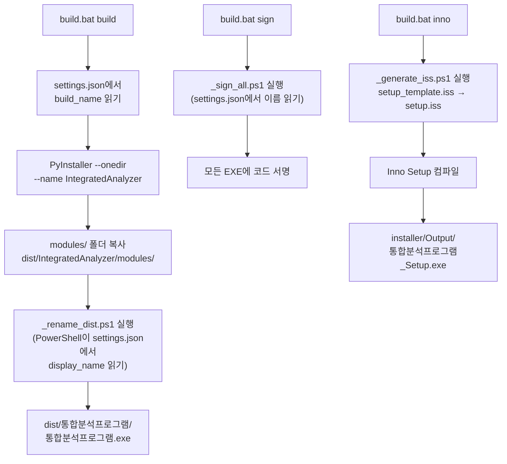
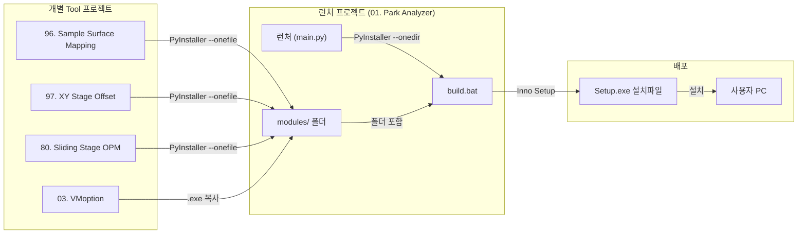
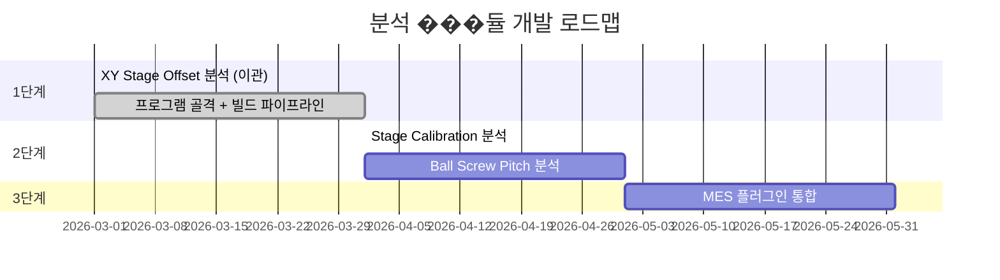

# 통합 분석 프로그램 — 종합 가이드

> **최종 업데이트**: 2026-04-03  
> **현재 버전**: 1.0.0  
> **현재 프로그램명**: 통합 분석 프로그램 (`config/settings.json`에서 관리)

---

## 목차

1. [프로그램 개요](#1-프로그램-개요)
2. [배경 및 목적](#2-배경-및-목적)
3. [기술 스택](#3-기술-스택)
4. [프로젝트 구조](#4-프로젝트-구조)
5. [설정 관리](#5-설정-관리-configsettingsjson)
6. [런처 사용법](#6-런처-사용법)
7. [빌드 & 배포](#7-빌드--배포)
8. [모듈 관리](#8-모듈-관리)
9. [프로그램명 변경 가이드](#9-프로그램명-변경-가이드)
10. [아키텍처 참고](#10-아키텍처-참고)

---

## 1. 프로그램 개요

### 1.1 소개

**통합 분석 프로그램**은 Park Systems 반도체 장비의 각종 분석 Tool들을 하나의 런처(Launcher)에서 통합 관리하는 데스크톱 프로그램입니다.

기존에는 분석 Tool마다 별도의 `.exe` 파일이 흩어져 있어 엔지니어가 필요한 Tool을 찾고, 데이터를 전처리하고, 개별 실행해야 했습니다. 이 프로그램은 그 모든 과정을 **한 곳에서, 전처리 없이, 클릭 한 번**으로 해결합니다.

### 1.2 핵심 특징

| 특징 | 설명 |
|------|------|
| **통합** | 흩어진 분석 Tool들을 하나의 런처에서 탐��, 검색, 실행 |
| **전처리 자동화** | Raw 데이터를 넣으면 전처리 없이 바로 분석 결과 산출 |
| **모듈 확장** | 새로운 분석 Tool을 `modules/` 폴더에 추가하면 런처가 자동 인식 |
| **사용 편의** | 통일된 다크 테마 UI, 카테고리 필터, 즐겨찾기(핀) 기능 |
| **이름 중앙 관리** | `settings.json` 한 곳만 수정하면 UI/빌드/설치 전체에 반영 |

### 1.3 대상 사용자

- 반도체 장비 QC(품질관리) 엔지니어
- 기술적 배경은 있지만 프로그래밍 지식은 불필요

---

## 2. 배경 및 목적

### 2.1 QC Check MES와의 관계

QC Check MES는 장비 QC 전체 프로세스(Config Wizard, 체��리스트, 규칙 엔진 등)를 관리하는 대규모 시스템입니다. 완성까지 시간이 걸리는 반면, 분석 플러그인(XY Stage Offset 등)�� 이미 독립 실행 가능한 수준으로 개발되어 있습니다.

### 2.2 독립 배포 전략

**MES 완성 전에 분석 Tool을 먼저 독립 프로그���으로 배포**하고, 향후 MES 플러그인으로 통합하는 전략입니다.

### 2.3 코드 공유 원칙

> **핵심 원칙**: 분석 로직(`analyzer.py`, `models.py` 등)은 MES 플러그인과 **100% 동일한 코드**를 사용하고, UI/빌드 설정만 독립 프로그램용으로 구성합니다.

| | QC Check MES | 통합 분석 프로그램 (독립) |
|---|---|---|
| **목적** | 장비 QC 전체 프로세스 관리 | 분석 도구 모음 (빠른 배포) |
| **GUI** | PySide6 | PySide6 (동일) |
| **DB** | SQLAlchemy + SQLite/PostgreSQL | 없음 (파일 기반) |
| **분석 코드** | 플러그인으로 로드 | 직접 import (`core/`) |
| **��증** | 로그인 필요 | 없음 |
| **빌��** | Nuitka + Inno Setup | PyInstaller + Inno Setup |
| **배포 대상** | QC팀 전체 | 엔지니어 개인 |

---

## 3. 기술 스택

### 3.1 언어 & 런타임

| 항목 | ���택 | 버전 | 이유 |
|------|------|------|------|
| **Python** | ✅ | 3.11+ | MES와 동일, 분석 모듈 코드 공유 |

### 3.2 GUI 프레임워크

| 항목 | 선택 | 버전 | 이유 |
|------|------|------|------|
| **PySide6** | ✅ | >= 6.6 | MES와 동일, 다크 테마 QSS 공유 |

### 3.3 데이터 분석 (개별 Tool에서 사용)

| 라이브러리 | 버��� | 용도 |
|-----------|------|------|
| **numpy** | >= 1.26 | 수치 연산, 행렬 계산 |
| **scipy** | >= 1.12 | Affine Transform 최소자승법 |
| **pandas** | >= 2.1 | CSV 파싱, DataFrame 기반 통계 |
| **matplotlib** | >= 3.8 | 차트 시각화 (Contour, Vector, Trend 등) |
| **openpyxl** | >= 3.1 | Excel 리포트 내보내기 |
| **tifffile** | >= 2024.1 | TIFF Raw Data 로드 |
| **Pillow** | >= 10.0 | 이미지 ��리 보조 |

### 3.4 인프라

| 라이브러리 | 버전 | 용도 |
|-----------|------|------|
| **loguru** | >= 0.7 | 로깅 (파일 + 콘솔) |

### 3.5 빌드 & 패키징

| 도구 | 버전 | 용도 |
|------|------|------|
| **PyInstaller** | >= 6.0 | Python -> standalone exe 패키징 |
| **Inno Setup 6** | 6.x | Windows 설치 프로그램 생성 |

> Tool 모듈은 `--onefile` (단일 exe), 런처는 `--onedir` (폴더 + exe) 모드로 빌드합니��.

### 3.6 런처 requirements.txt

```
# === GUI ===
PySide6>=6.6

# === Infrastructure ===
loguru>=0.7
```

> MES 대비 **제외 항��**: SQLAlchemy, alembic, psycopg2, pydantic, reportlab, python-docx 등

---

## 4. 프로젝트 구조

```
01. Park Analyzer/
├── main.py                          # 앱 진입점
├── requirements.txt                 # 런처 의존성
├── build.bat                        # 런처 빌드 스크립트 (PyInstaller + Sign + Inno)
├── build_all.bat                    # 전체 빌드 실행기 (build_all.ps1 호출)
├── build_all.ps1                    # 전체 빌드 PowerShell 스크립트
│
├── config/
│   └── settings.json                # ⭐ 앱 설정 (프로그램명, 버전, 테마 등)
│
├── core/                            # 핵심 모듈
│   ├── __init__.py
│   ├── module_manager.py            # 모듈 자동 탐색 & subprocess 실행
│   └── settings.py                  # JSON 설정 로드/저장
│
├── ui/                              # GUI 레이어
│   ├── __init__.py
│   ├── main_window.py               # 메인 ���도우 (검색, 카테고리, 카드, 로그)
│   └── styles.py                    # Catppuccin Mocha 다크 테마 QSS
│
├── modules/                         # 분석 모듈 (각 Tool 등록)
│   ├── sample_surface_mapping/
│   │   └── module.json
│   ├── xy_stage_offset/
│   │   └── module.json
│   ├── sliding_stage_opm/
│   │   └── module.json
│   └── vmoption/
│       └── module.json
│
├── assets/
│   └── app.ico                      # 앱 아이콘
│
├── installer/
│   ├── setup_template.iss           # Inno Setup 템플릿 (플레이스홀더 포함)
│   ├── setup.iss                    # 자동 생성됨 (��드 시)
│   ├── sign.bat                     # 코드 서명 유틸리티
│   ├── _generate_iss.ps1            # setup_template -> setup.iss 생성
│   ├── _rename_dist.ps1             # 빌드 �� 한글 이름으로 rename
│   ├── _sign_all.ps1                # 모든 EXE 일괄 서명
│   ├── _sign_installer.ps1          # 설치파일 서명
│   ├── create_cert.ps1              # 서명 인증서 생성
│   ├── park_signing.pfx             # 서명 인증서 (비공개키)
│   ├── park_signing.cer             # 서명 인증서 (공개키)
│   └── Output/                      # 설치 프로그램 출력 폴더
│
├── doc/
│   └── README.md                    # 이 문서
│
├── build/                           # PyInstaller 빌드 캐시 (자동 생성)
└── dist/                            # 빌드 결과물 (자동 생성)
```

### 주요 파일 역할

| 파일 | 역할 |
|------|------|
| `main.py` | 앱 진입점. settings.json에서 프로그램명을 읽어 UI에 반영 |
| `core/module_manager.py` | `modules/` 폴더 자동 스캔, `module.json` 파싱, subprocess로 Tool 실행 |
| `core/settings.py` | JSON 설정 로드/저장. 기본값과 사용자 설정을 deep merge |
| `ui/main_window.py` | PySide6 메인 윈도우. 카테고리 바, 모듈 카드, 로그 패널 |
| `ui/styles.py` | Catppuccin Mocha 기반 다크 테마 QSS 상수 |
| `config/settings.json` | 프로그램명, 버전, 개발모드, 창 크기, 핀 목록 등 중앙 설정 |

---

## 5. 설정 관리 (config/settings.json)

### 5.1 현재 설정 내용

```json
{
  "app": {
    "version": "1.0.0",
    "display_name": "통합 분석 프로그램",
    "build_name": "IntegratedAnalyzer",
    "dev_mode": true,
    "language": "ko"
  },
  "window": {
    "width": 1902,
    "height": 991
  },
  "pinned": []
}
```

### 5.2 필드 설명

| 필드 | 타입 | 설명 |
|------|------|------|
| `app.version` | string | 프로그램 버전 (UI 헤더, 설치 프로그램에 표시) |
| `app.display_name` | string | **사용자에게 보이는 프로그램명** (UI 타이틀, 설치 마법사, 바로가기) |
| `app.build_name` | string | **빌드 시 사용하는 ASCII 이름** (PyInstaller --name, 로그 폴더) |
| `app.dev_mode` | boolean | `true`: 개발 모드 (main.py로 Tool 실행), `false`: 배포 모드 (main.exe로 실행) |
| `app.language` | string | UI 언�� (`"ko"` / `"en"`) |
| `window.width` | number | 마지막 창 너비 (자동 저장) |
| `window.height` | number | 마지막 창 높이 (자동 저장) |
| `pinned` | array | 즐겨찾기 고정된 모듈 ID 목록 |

### 5.3 프로그램명 중앙 관리

`display_name`과 `build_name`은 아래 모든 곳에서 자동으로 읽혀 사용됩니다:

| 사용처 | 읽는 필드 | 적용 방식 |
|--------|-----------|-----------|
| 윈도우 타이틀 | `display_name` | `main.py`, `main_window.py`에서 settings 읽기 |
| UI 헤더 라벨 | `display_name` | `main_window.py`에서 settings 읽기 |
| 로그 메시지 | `display_name` | `main.py`에서 settings 읽기 |
| 로그 파일 경로 | `build_name` | `AppData/Local/{build_name}/logs/` |
| PyInstaller --name | `build_name` | `build.bat`에서 PowerShell로 파싱 |
| exe/폴�� 최종 이름 | `display_name` (공백 제거) | `_rename_dist.ps1`에서 settings 읽기 |
| Inno Setup 설치명 | `display_name` | `_generate_iss.ps1`에서 settings 읽기 |
| 코드 서명 대상 | `display_name` (공백 제거) | `_sign_all.ps1`에서 settings 읽기 |

---

## 6. 런처 사용법

### 6.1 개발 모드 실행

```bash
# 의존성 설치 (최초 1회)
pip install -r requirements.txt

# 런처 실행
python main.py
```

### 6.2 UI 구성

```
┌─────────────────────────────────────────────────────────��
│  🔬 통합 분석 프로그램                            v1.0.0 │
├──────────────┬──────────────────────────────────────────┤
│              │                                          │
│  🔍 Tool 검색 │   ┌────────────────────────────────┐    │
│              │   │ 🗺️ Sample Surface Mapping v1.0.0│    │
│  ⭐ Pinned   │   │  웨이퍼 표면 맵핑 및 패턴 분석  │    │
│  (즐겨찾기)   │   │  ● Ready   [Log] [Manual] [Run]│    │
│              │   └────────────────────────────────┘    │
│  ■ XY Stage  │   ┌────────────────────────────────┐    │
│  ■ Sliding   │   │ 📊 XY Stage Offset      v1.0.0│    │
│  ■ Utility   │   │  XY 스테이지 옵셋 분석         │    │
│  (카테고리)   │   │  ● Ready   [Log] [Manual] [Run]│    │
│              │   └────────────────────────────────┘    │
├──────────────┴──────────────────────────────────────────┤
│ [19:05:23] 통합 분석 프로그램 시작                        │
│ [19:05:23] ✅ 모듈 탐색: Sample Surface Mapping          │
│ [19:05:23] 총 4개 모듈 탐색 완료                         │
└─────────────────────────────────────────────────────────┘
```

- **왼쪽 패널**: Tool 검색바, 즐겨찾기(핀) 영역, 카테고리별 가로 막대 그래프
- **오른쪽 패널**: 선택된 카테고리의 모듈 카드 목록
- **하단 패널**: 실시간 로그 출력

### 6.3 모듈 카드 기능

| 버튼 | 기능 |
|------|------|
| **Run** | 해당 Tool 실행 (dev_mode에 따라 main.py 또는 main.exe 실행) |
| **Log** | 변경 이력(changelog) 팝업 표시 |
| **Manual** | 웹 매뉴얼 URL 열기 (module.json에 설정된 경우) |
| **📌 핀** | 즐겨찾기 토글 (상단 Pinned ���션에 고정) |

### 6.4 모듈 상태

| 상태 | 색상 | 의미 |
|------|------|------|
| Ready | 🟢 초록 | 실행 파일/경로가 유효하여 실행 가능 |
| Running | ��� 파랑 | 현재 실행 중 |
| Path missing | 🟠 주��� | 개발 경로 또는 exe 파일을 찾을 수 없음 |

### 6.5 dev_mode 전환

`config/settings.json`에서 `dev_mode` 값을 변경합니다:

- **`true` (개발 모드)**: 각 Tool의 `dev_path` + `entry_dev` (예: `main.py`)를 Python으로 실행
- **`false` (배포 모드)**: `modules/<id>/` 내의 `entry_prod` (예: `main.exe`)를 직접 실행

---

## 7. 빌드 & 배포

### 7.1 빌드 스크립트 개요

| 스크립트 | 용도 | 실행 방법 |
|----------|------|-----------|
| `build.bat` | **런처만** 빌드 + 서명 + 설치파일 | 런처 코드만 변경했을 때 |
| `build_all.bat` | **모든 Tool + 런처** 일괄 빌드 | 전체 배포 시 |

### 7.2 런처 빌드 (build.bat)

```
build.bat              # 전체 실행 (빌�� → 서명 → 설치파일)
build.bat build        # [1/3] PyInstaller 빌드만
build.bat sign         # [2/3] 코드 서명만
build.bat inno         # [3/3] Inno Setup 설치파일만
```

#### 빌드 흐름 상세



#### 왜 ASCII 이름으로 빌드 후 rename하는가?

Windows `cmd.exe`(배치 파일)는 `set` 변수에 한글을 넣으면 확장 시 문자열이 깨집니다. `chcp 65001`은 콘솔 출력만 바꾸며, 배치 파일 파싱에는 영향을 주지 않습니다.

따라서:
1. **build.bat**에서는 ASCII 이름(`IntegratedAnalyzer`)으로 PyInstaller 빌드
2. 빌드 완�� 후 **PowerShell** 스크립트(`_rename_dist.ps1`)가 `settings.json`에서 `display_name`을 읽어 한글 이름으로 rename
3. **.ps1 파일**은 UTF-8 네이티브 지원이므로 한글 처리에 문제 없음 (단, UTF-8 BOM 필수)

> **중요**: `.bat` 파일에는 절대 한글을 넣지 마세요. 빌드가 깨집니다.  
> **중요**: `.ps1` 파일은 반드시 UTF-8 with BOM으로 저장해야 합니다.

#### setup.iss 동적 생성

`installer/setup_template.iss`에 플레이스홀더를 사용:

```
#define MyAppName "{{DISPLAY_NAME}}"
#define MyAppVersion "{{VERSION}}"
#define MyAppExeName "{{EXE_NAME}}.exe"
```

빌드 시 `_generate_iss.ps1`이 `settings.json`을 읽어 플레이스홀더를 치환하고 `setup.iss`를 생성합니다.

### 7.3 전체 빌드 (build_all.bat)

`build_all.bat`을 실행하면 `build_all.ps1`이 호��되어 아래 6단계를 순차 실행합니다:

| 단계 | 내용 | 상세 |
|------|------|------|
| **[1/6]** | Sample Surface Mapping 빌드 | `96. Sample_Surface_Mapping/` → `--onefile` |
| **[2/6]** | XY Stage Offset 빌드 | `97. XY Stage Positioning Offset Analysis/` → `--onefile` |
| **[3/6]** | Sliding Stage OPM 빌드 | `80. Sliding Stage OPM Repeatability/` → `--onefile` |
| **[4/6]** | Tool .exe를 modules/에 복사 | 각 `dist/*.exe` → `modules/<id>/main.exe` |
| **[5/6]** | 런처 빌드 | `--onedir` + modules/ 복사 + 한글 rename |
| **[6/6]** | 코드 서명 | `_sign_all.ps1` 호출 |

전체 빌드 완료 후:

```bash
build.bat inno    # Inno Setup 설치 프로그램 생성
```

### 7.4 코드 서��

#### 인증서 생성 (최초 1회)

```powershell
# 자체 서명 인증서 생성
powershell -ExecutionPolicy Bypass -File installer\create_cert.ps1
```

생성된 파일:
- `installer/park_signing.pfx` — 서명용 비공개키
- `installer/park_signing.cer` — 공개 인증서

#### 개별 파일 서명

```bash
installer\sign.bat <파일경로>          # 단일 파일 서명
installer\sign.bat --all               # dist/ 내 모든 EXE 서명
```

### 7.5 설치 프로그램 생성 (Inno Setup)

**전제 조건**:
- [Inno Setup 6](https://jrsoftware.org/isdl.php) 설치 필요
- `build.bat build`로 런처 빌드가 먼저 완료되어야 함

```bash
build.bat inno
```

**결과물 위치**:

```
installer/Output/통합분석프로그램_Setup.exe
```

### 7.6 배포

1. `installer/Output/통합분석프로그램_Setup.exe`를 사용자에게 전달
2. 사용자가 설치 실행
3. 기본 설치 경로: `C:\Program Files\통합 분석 프로그램\`
4. 시작 메뉴 및 바탕화면에 바로가기 생성
5. Windows Defender 제외 경로 자동 등록

---

## 8. 모듈 관리

### 8.1 현재 등록된 모듈

| 모듈 | 카테고리 | 설명 | 프로젝트 폴더 |
|------|----------|------|--------------|
| Sample Surface Mapping | XY Stage | 웨이퍼 표면 맵핑 및 패턴 분석 | `96. Sample_Surface_Mapping` |
| XY Stage Positioning Offset Analysis | XY Stage | XY 스테이지 위치 결정 옵셋 분석 | `97. XY Stage Positioning Offset Analysis` |
| Sliding Stage OPM Repeatability | Sliding Stage | 슬라이딩 스테이지 OPM 반복성 분석 | `80. Sliding Stage OPM Repeatability` |
| VM Option Generator | Utility | 장비 VM 옵션 자동 생성기 | `03. VMoption` |

### 8.2 module.json 스키마

각 모듈��� `modules/<tool_id>/module.json` 파일로 런처에 등록됩니다.

```json
{
    "id": "xy_stage_offset",
    "name": "XY Stage Positioning Offset Analysis",
    "category": "XY Stage",
    "version": "1.0.0",
    "description": "XY 스테이지 위치 결정 옵셋 분석",
    "icon": "📊",
    "dev_path": "C:/Users/Spare/Desktop/03. Program/97. XY Stage Positioning Offset Analysis",
    "entry_dev": "src/main.py",
    "entry_prod": "main.exe",
    "changelog": [
        "v1.0.0 — 초기 릴리즈"
    ],
    "manual_url": ""
}
```

| 필드 | 필수 | 설명 |
|------|------|------|
| `id` | ✅ | 모듈 고유 ID (폴더명과 동일해야 함) |
| `name` | ✅ | 런처 UI에 표시되는 이름 |
| `category` | ✅ | 카테고리 분류 (왼쪽 패널에 막대 그래프로 표시) |
| `version` | ✅ | 버전 문자열 |
| `description` | ✅ | ���줄 설명 (카드에 표시) |
| `icon` | | 이모지 아이콘 (기본: 📊) |
| `dev_path` | | 개발 폴더 절대 경로 (dev_mode=true 시 사용) |
| `entry_dev` | | 개발 모드 진입점 (기본: `main.py`) |
| `entry_prod` | | 배포 모드 진입점 (기본: `main.exe`) |
| `changelog` | | 변경 이력 배열 (Log 버튼으로 표시) |
| `manual_url` | | 웹 매뉴얼 URL (Manual 버튼으로 열기) |

### 8.3 새 모듈 추가 체크리스트

#### Step 1: 프로젝트 폴더에 build.bat 준비

기존 프로젝트의 `build.bat`를 복사한 뒤, 프로젝트 경로와 패키지명을 수정합니다.

#### Step 2: modules/ 에 모듈 등록

```bash
# 1) 폴더 생성
mkdir modules\my_new_tool

# 2) module.json 작성
# 기존 모듈의 module.json을 복사해서 수정
copy modules\xy_stage_offset\module.json modules\my_new_tool\module.json
# → id, name, dev_path 등을 새 Tool에 맞게 수정
```

#### Step 3: build_all.ps1에 빌드 명령 추가

`build_all.ps1`에 새 Tool의 빌드 섹션과 복사 섹션을 추가합니다:

```powershell
# [N/6] New Tool
Write-Host "[N/6] Building: My New Tool..."
$proj = "$ROOT\XX. My New Tool"
Set-Location $proj
python -m PyInstaller --noconfirm --onefile --windowed --name "MyNewTool" --distpath dist main.py
if ($LASTEXITCODE -ne 0) { Write-Host "[FAIL] My New Tool"; exit 1 }

# Copy 섹션에 추가:
Copy-Item -Force "$ROOT\XX. My New Tool\dist\MyNewTool.exe" "$MODULES\my_new_tool\main.exe"
```

#### Step 4: 테스트

1. `python main.py` 실행하여 새 Tool이 목록에 나타나는지 확인
2. **Run** 버튼 클릭하여 정상 실행되는지 확인
3. `build_all.bat` ��행하여 전체 빌드 성공 확인

---

## 9. 프로그램명 변경 가이드

프로그램명을 변경하려면 **`config/settings.json` 한 곳만 수정**하면 됩니다.

### 9.1 변경 절차

```json
// config/settings.json
{
  "app": {
    "display_name": "새로운 프로그램 이름",   // ← 여기만 수정
    "build_name": "NewProgramName",          // ← 필요 시 변경 (ASCII만)
    ...
  }
}
```

그 다음 빌드:

```bash
build.bat           # 빌드 → 서명 → 설치파일 생성
```

**끝!** 다른 파일은 수정할 필요 없습니다.

### 9.2 자동 반영되는 곳

| 반영 대상 | display_name | build_name |
|-----------|:---:|:---:|
| 윈도우 타이틀 (`�� ...`) | ✅ | |
| UI 헤더 라벨 | ✅ | |
| 로그 메시지 | ✅ | |
| 로그 파일 경로 (`AppData/Local/...`) | | ✅ |
| PyInstaller 빌드명 | | ✅ |
| exe/폴더 최종 이름 (공백 제거) | ✅ | |
| Inno Setup 설치 마법사 | ✅ | |
| 설치 경로 (`Program Files/...`) | ✅ | |
| 시작메뉴/바탕화면 바로가기 | ✅ | |
| 설치파일명 (`..._Setup.exe`) | ✅ | |
| 코드 서명 대상 경로 | ✅ | |

### 9.3 주의사항

> **.bat 파일에 한글을 넣지 마세요**  
> Windows cmd.exe는 배치 파일을 시스템 코드페이지(CP949)로 파싱합니다. UTF-8 한글이 들어가면 바이트 단위로 깨져서 명령어 전체가 손상됩니다.

> **.ps1 파일은 UTF-8 BOM 필수**  
> PowerShell 5.x는 BOM 없는 UTF-8 파일을 시스템 코드페이지로 읽습니다. 한글이 포함된 `.ps1` 파일은 반드시 UTF-8 with BOM으로 저장해야 합니다.

> **build_name은 ASCII만 사용**  
> `build_name`은 cmd.exe 변수에서 사용되므로 영문/숫자만 허용됩니다.

---

## 10. 아키텍처 참고

### 10.1 전체 빌드 파이프라인



### 10.2 MES 플러그인 코드 공유 전략

**현재 (방법 A: 복사 후 동기화)**

```
qc_check_mes/plugins/xy_stage_offset/  ←→  park_analyzer/core/
```

- 분석 로직을 양쪽에 동일 코드로 유지
- 독립 프로그램에서 먼저 개발 → 안정화 후 MES 플러그인에 반영

**향후 (방법 B: 공유 패키지)**

분석 모듈이 3개 이���으로 늘어나면 pip install 가능한 공유 패키지로 전환 검토:

```
park_analysis_core/       ← pip install 가능한 패키지
├── analyzer.py
├── models.py
└── csv_parser.py
```

### 10.3 분석 모듈 확장 로드맵



---

## 부록: 빠른 참조

### 자주 사용하는 명령어

```bash
# 개발 모드 실행
python main.py

# 런처만 빌드
build.bat build

# 전체 빌드 (모든 Tool + 런처)
build_all.bat

# 설치 프로그램 생성
build.bat inno

# 코드 서명
build.bat sign
```

### 프로그램명 변경

```json
// config/settings.json 수정
"display_name": "��하는 이름"
```

### 새 Tool 추가

1. `modules/<id>/module.json` 생성
2. `build_all.ps1`에 빌드 명령 추가
3. `python main.py`로 확인
